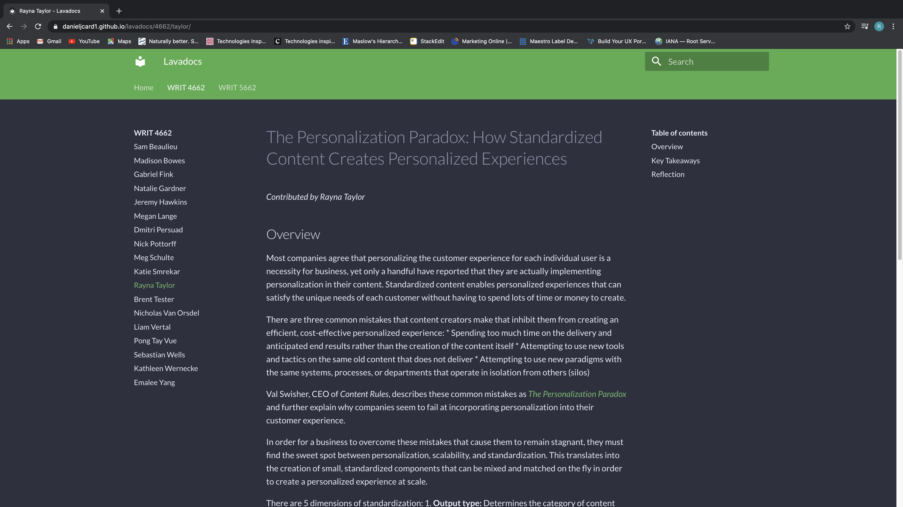

# Digital Literacy Narrative V.2

Hi, my name is Rayna and welcome to my website! This semester was unlike any other as we all had to adapt to the lifestyle changes that COVID-19 presented to us. I was a bit nervous about taking WRIT 4662W fully online as I wasn't sure what to expect in terms of learning new digital writing technologies. Thanks to the countless resources provided by the professor and my determination to learn, I am proud to say that I have become somewhat acquainted with the likes of HTML, CSS, Markdown, MkDocs, and DITA as someone who came into the course with no prior knowledge.

## HTML and CSS

Our first major project of this course was to create a static site using HTML and CSS. This was my most challenging assignment as I had to learn the difference between HTML and CSS along with the relationship between these two coding languages and how they work together. I used Visual Studio Code to write the scripts for my practice static site in HTML and CSS. It's not much but I am proud of the progress I have made learning this program and coding language from scratch to produce a website depicted below.

## Markdown and MkDocs 

Markdown was relatively simple compared to HTML. To gain some practice working with Markdown, we were assigned to write feedback on a presentation from LavaCon 2020. I decided to use the in-browser Markdown editor *StackEdit* to nicely organize and edit my document. I feel as though Markdown markup language was not only created for readability, but was made for usability as well, keeping in mind technical writers to allow digital writing to flow smoother. Below is a snippet of my LavaDocs document that was rendered to a published class site using MkDocs. Here is also the link to my full analysis on [*The Personalization Paradox*](https://danieljcard1.github.io/lavadocs/4662/taylor/)

MkDocs prompted my first experience toying around with command prompts on a desktop. After viewing the ease and convenience that MkDocs could provide as a static site generator, I wanted to try my luck and use it to create my own site (this one!) I did have a few hiccups in the beginning as I am a Mac user, so the instructions and command prompts were not the same for me. Installing Python and pip was the challenging part for me, but once I got them installed it was smooth sailing from there. 

## Continuing the Journey

The challenges and triumphs of this course were well worth it in the end. As a technical writer, I feel that I am able to add these new "tools" to my itinerary as a content creator. Having this basic understanding and knowledge of these various avenues of digital writing technologies will allow me to continue my pursuit of becoming ever more versatile and adaptable as I explore the different sectionalizes of technical communication. Hopefully I am given the opportunity to expand my knowledge and experience in a more practical way and take a step back and observe just how far I have come.

